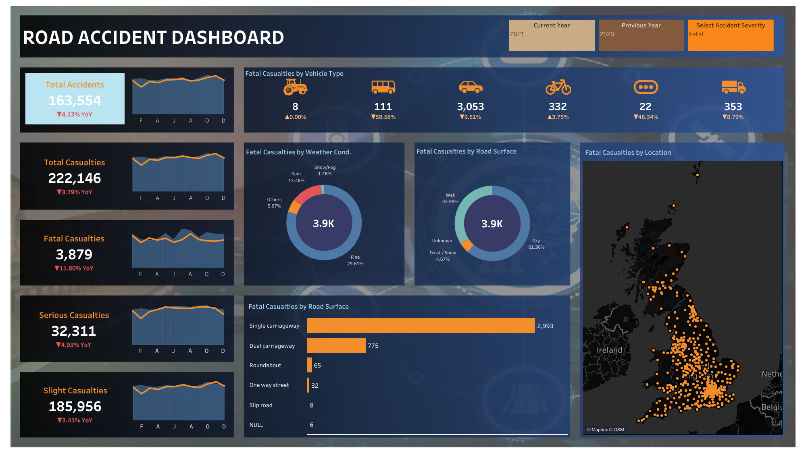

# Road Accident Analysis Tableau
The Road Accident Analysis Dashboard is a comprehensive visual tool designed to provide insights and facilitate informed decision-making regarding road safety measures. Developed using Tableau, this dashboard amalgamates data from a Kaggle data set to offer a holistic view of road accidents, their causes, and associated trends. The dashbaord utilizes a variety of key performance indicators (KPIs) to gauge the severity and ramifications of traffic accidents. These metrics encompass the total count of casualties categorized by the severity of the accidents, vehicle types involved, road classifications, and additional contributing factors.

# Key Objectives:
1. Vehicle Type and Impact Analysis:
Users can analyze the involvement of different vehicle types in accidents and their severity implications. Insights into collision dynamics, including vehicle size, speed, and angle of impact, assist in formulating vehicle safety standards and infrastructure enhancements.

2. Weather and Road Conditions Impact:
Integrated weather and road condition data evaluate how environmental factors influence accident rates. Users can discern correlations between weather patterns, road conditions, and accident severity, thereby enhancing preparedness and response strategies.

3. Accident Trends: 
Intuitive charts and graphs illustrate trends in accident occurrence over time. Users can discern patterns, seasonal fluctuations, and emerging trends to optimize resource allocation and implement preventive measures effectively.

# Accomplished Activities
1. Understanding the Business Case and Requirements.
   
3. Data Gathering:
I gathered the data from Kaggle data set.

5. Data Cleaning:
I Removed the duplicated records, validation of data types, sorting, and grouping for streamlined visualization.

7. Data Processing:
I Extracted the additional details to enrich analysis, including the creation of monthly and yearly columns to support trend analysis.

9. Data Analysis:
After importing the modified excel data sheet into Tableau, I utilizated the statistical techniques and algorithms to uncover insights, patterns, and correlations.

11. Data Visualization:
I Created visually engaging charts, graphs, and dashboards to communicate findings and facilitate decision-making.
